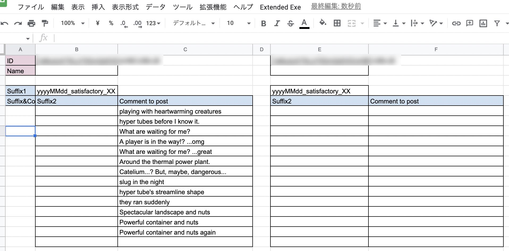
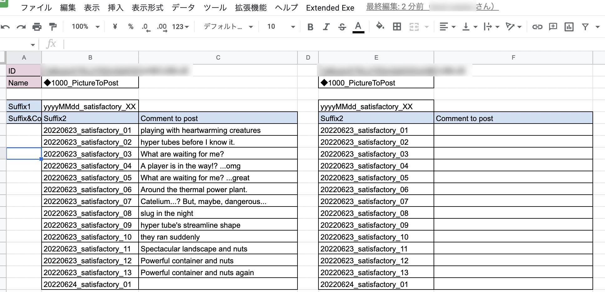

# ImagePostingSheet

# Table of Content

- [ImagePostingSheet](#imagepostingsheet)
- [Table of Content](#table-of-content)
- [What are Functions](#what-are-functions)
- [Operation](#operation)
- [Dependencies](#dependencies)
- [DevDependencies](#devdependencies)
# What are Functions

This function can manage to post image to SNS.

Sheet before execution.

Sheet after execution.

# Operation

1. Put image files you wanna post into the folder whose ID are these cells' values.
2. Click `ListImage by ID row` in the menu.
3. Operation is running.
4. When operation finishes, names of image files are listed.
5. Manage comments to SNS by names of image files' prefix.

# Dependencies

<table>
<thead><tr><th>Repository</th><th>Script ID</th></tr>
</thead><tbody>
<tr><td><a>LandGasterId</a></td><td></td></tr>
<tr><td><a href="https://github.com/landmaster135/LandmasterLibraryGas">LandmasterLibraryGas</a></td><td><code>1RT9wqSQIY82cdkNNP0Pz5TF0knsFDTr8b5MdpwHLMxgWoi2pw6y2E9Mk</code></td></tr>
</tbody></table>

# DevDependencies

<table>
<thead><tr><th>Repository</th><th>Script ID</th></tr>
</thead><tbody>
<tr><td><a href="https://github.com/landmaster135/TestGAS">TestGAS</a></td><td><code>1CRjWWWYfjD7WzPl43RB1BiD7XDLJmR03eEpXr2LMh75yAq5qMlczOIfm</code></td></tr>
</tbody></table>
